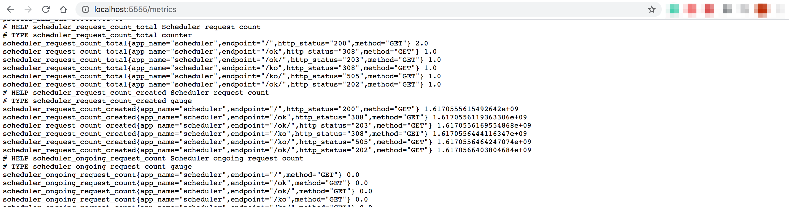
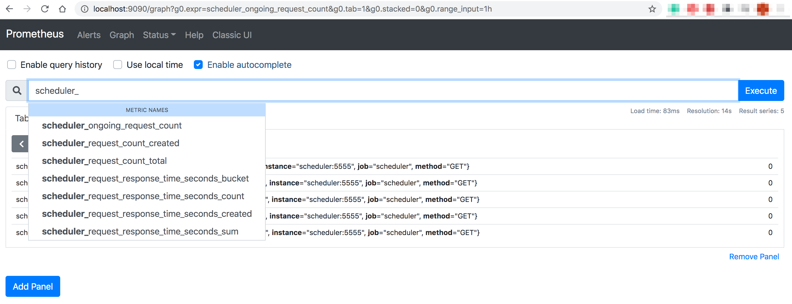
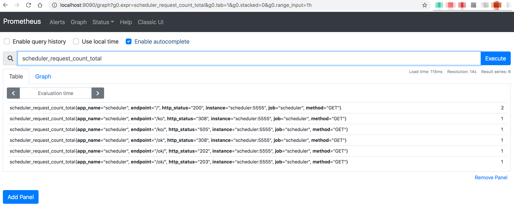
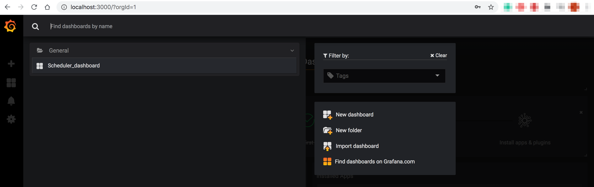

# Flask scheduler + Prometheus + Grafana

Hello,

Thank you for being here!
Here you have a small Flask application with in-built scheduler.
Each 20s the application pings ok/ and ko/ endpoints in a random way, and
replies with a random response code.

The application metrics are exposed in Prometheus format 
on /metrics endpoint.

```
localhost:5555
```



### Prometheus

Prometheus reads the metrics exposed by the application

```
localhost:9090
```





### Grafana

Grafana uses Prometheus as data source and has a ready 
prebuilt dashboard

```
localhost:3000
# login/password: admin/admin
```




### How to run in local

```
vagrant up
vagrant ssh
vagrant@vagrant:~$ cd scheduler
vagrant@vagrant:~/scheduler$ docker-compose up -d

vagrant@vagrant:~/scheduler$ docker ps
CONTAINER ID        IMAGE                  COMMAND                  CREATED             STATUS              PORTS                    NAMES
95a727e58b7a        scheduler/grafana      "/run.sh"                9 seconds ago       Up 9 seconds        0.0.0.0:3000->3000/tcp   grafana
dd38319a50c5        scheduler/scheduler    "python3 ./run.py"       10 seconds ago      Up 9 seconds        0.0.0.0:5555->5555/tcp   scheduler
6d01a0c22311        scheduler/prometheus   "/bin/prometheus --c…"   10 seconds ago      Up 9 seconds        0.0.0.0:9090->9090/tcp   prometheus
```

